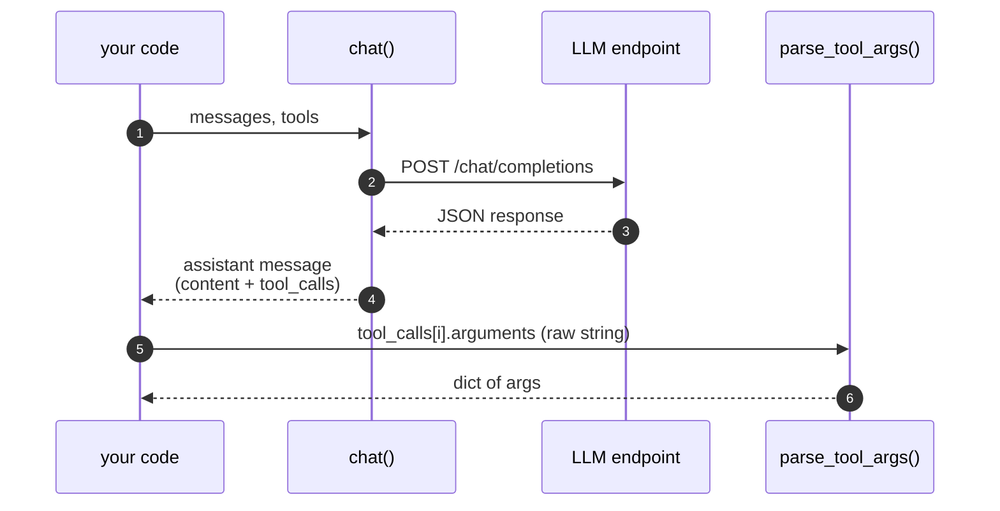

## In this chapter

You'll write the smallest possible "provider" — a thirty-line Python file that talks to any
OpenAI-compatible chat-completion endpoint. No SDK. No frameworks. Just `httpx`.

By the end you'll have:

- Written `chat(messages, tools=None)` — one round-trip over HTTP, returns the assistant message.
- Sent a real `curl` against Ollama and read the JSON it sends back.
- Wired the `tools` field and seen `tool_calls` come back on the assistant message.
- Parsed tool arguments tolerantly — clean JSON, single-quoted JSON, and trailing-comma JSON.
- Confirmed you can swap to Anthropic or OpenAI by changing env vars, not code.

Time: ~30 minutes. Hardware: anything that runs Ollama.

**Optional — skip this and Ch1 still works.** A reference `provider.py` already lives in the tree;
Ch1's loop runs against either yours or that one. The point of the warm-up is to take the magic
out of "calling an LLM" before you build a loop around it.

---

> *"Show me your agent," said the student.*
> *Budo handed him a curl command. "First show me you can speak."*
> *The student blinked. "That's just HTTP."*
> *"Yes," said Budo. "And that's just the trick."*

## The problem

Before you write a loop, you must speak to the model. The model is an HTTP endpoint. That is the
whole secret. Every "AI SDK" is a thin wrapper around a POST that returns JSON.

We will skip the wrappers and do the POST ourselves — once. After that, you'll never again wonder
what an agent framework is doing under the hood, because there is no under the hood.

## What you'll build

A file called `provider.py` with exactly two functions:

```python
def chat(messages, tools=None) -> dict: ...
def parse_tool_args(raw) -> dict: ...
```

`chat` does one round-trip to a chat-completion endpoint and returns the assistant message.
`parse_tool_args` reads the JSON string the model emits as tool arguments and survives the
small sins local models commit.

That's it. Two functions. No classes. No retries. No streaming. Ch1 builds the loop on top.



## Concepts

An **OpenAI-compatible chat-completion endpoint** is one URL:

```
POST {BASE_URL}/chat/completions
```

The request body is a small JSON object:

```json
{
  "model": "qwen2.5:14b",
  "messages": [{"role": "user", "content": "hello"}],
  "temperature": 0,
  "tools": [ /* optional, tool specs */ ]
}
```

The response wraps the assistant's reply:

```json
{
  "choices": [{
    "message": {"role": "assistant", "content": "Hi there!"}
  }]
}
```

When you pass `tools` and the model decides to call one, `message.content` is usually empty and a
`tool_calls` list appears instead:

```json
"message": {
  "role": "assistant",
  "content": null,
  "tool_calls": [{
    "id": "call_abc",
    "type": "function",
    "function": {"name": "get_pods", "arguments": "{\"namespace\":\"shop\"}"}
  }]
}
```

Two things to notice:

1. `arguments` is a **string**, not a parsed object. The endpoint hands you JSON-inside-JSON.
   You parse it yourself. That's `parse_tool_args`.
2. The shape is identical across providers. Ollama, OpenAI, Anthropic-via-OpenAI-compat, vLLM,
   LM Studio — same JSON. That's why we read **everything** from env vars: same code, different
   endpoint.

Two design choices we make once and never revisit:

- **`temperature=0`.** Agents pick tools. Tool choices need to be reproducible or every debugging
  session becomes a séance.
- **Env vars, never code.** `OPENAI_BASE_URL`, `BUDO_MODEL`, `OPENAI_API_KEY`. Swap provider →
  export different values → same code runs.

## Build

The lab lives at `labs/warmup-llm-client/`. Open it in another pane.

### Step 1 — Prove the endpoint with `curl`

Before any Python, prove the endpoint is up. From the lab dir:

```bash
just curl-test
```

Under the hood, that's just:

```bash
curl -sS http://localhost:11434/v1/chat/completions \
  -H "Content-Type: application/json" \
  -H "Authorization: Bearer ollama" \
  -d '{"model":"qwen2.5:14b","messages":[{"role":"user","content":"Say hi in one short sentence."}],"temperature":0}'
```

You should see a JSON blob with a sentence inside `choices[0].message.content`. If you don't,
fix Ollama before touching Python. Plumbing errors are easier to debug at the HTTP layer.

> **Budo says:** if `curl` works and your Python doesn't, the bug is in your Python. If `curl`
> doesn't work, the bug is in your laptop. Always know which one.

### Step 2 — Write `chat()`

Open `labs/warmup-llm-client/starter/provider_skeleton.py`. The skeleton already has imports
and env-var reads. You fill in the body:

```python
def chat(messages, tools=None, temperature=0.0):
    body = {"model": MODEL, "messages": messages, "temperature": temperature}
    if tools:
        body["tools"] = tools
    r = httpx.post(
        f"{BASE_URL}/chat/completions",
        json=body,
        headers={"Authorization": f"Bearer {API_KEY}"},
        timeout=300,
    )
    r.raise_for_status()
    return r.json()["choices"][0]["message"]
```

Four decisions worth naming:

| Line | Why |
|---|---|
| `if tools: body["tools"] = tools` | An empty `tools` field confuses some endpoints. Omit it unless you actually have tools. |
| `Authorization: Bearer …` | Required by paid APIs, ignored by Ollama. Always send it; portability is cheap. |
| `timeout=300` | Local 14B models can take 30–60s on cold cache. Generous, not magical. |
| `r.raise_for_status()` | Turn 4xx/5xx into a real Python exception. Silent failure is the worst failure. |

Test it now:

```bash
just test
```

You should see a sentence printed. If you see a stack trace, read it — `raise_for_status` will
tell you exactly what the endpoint said.

### Step 3 — Pass `tools` through and look at the response

You don't write tool definitions yet — Ch1 does that. For now, just confirm the field passes
through. Drop this in a scratch session (`python3` REPL, from the `starter/` dir):

```python
from provider_skeleton import chat

tools = [{
    "type": "function",
    "function": {
        "name": "get_time",
        "description": "Returns the current time.",
        "parameters": {"type": "object", "properties": {}},
    },
}]

msg = chat([{"role":"user","content":"What time is it? Use the tool."}], tools=tools)
print(msg)
```

If the model is tool-capable (`qwen2.5:14b` is), `msg` looks like:

```python
{'role': 'assistant', 'content': '', 'tool_calls': [{'id': '...', 'type': 'function',
 'function': {'name': 'get_time', 'arguments': '{}'}}]}
```

`arguments` is a string. Parsing it is the next function.

### The meter — the bill rides on every response

Before moving on, scroll back through the raw JSON your endpoint returned (or re-run the
Step 1 `curl`). There's a block you probably skimmed past:

```json
"usage": {"prompt_tokens": 27, "completion_tokens": 12, "total_tokens": 39}
```

Every OpenAI-compatible endpoint — Ollama included — reports this on every single response.
`prompt_tokens` is everything the model just *read* (your whole messages array plus tool
specs — in an agent loop, this is your live context size). `completion_tokens` is what it
*generated*. Hosted providers bill you on exactly these two numbers; Ollama charges watts
and patience instead, but the arithmetic is identical.

The budo tree reads this block for you: the in-tree provider times each call and feeds a
tiny session meter, `budo/core/usage.py` (~50 lines — go read it, it's the whole mechanism).
From Ch1 on, every run ends with:

```
⏱  6 llm calls · 143.2s in-model · 11,482 in / 903 out tok · $0 local (BUDO_PRICE_IN/OUT to price it)
```

…and at debug level you get one line per call — `» usage: ctx 1,842 tok · +156 out · 4.2s` —
which is your context window growing in real time. Two knobs, both env vars, both optional:

- **`BUDO_PRICE_IN` / `BUDO_PRICE_OUT`** — dollars per million tokens. Set them to a hosted
  model's rates and the footer prices every local run as if it ran there. A run that's free
  on your laptop but would cost $0.40 hosted is worth knowing about *before* you deploy.
- **`BUDO_OBS=logfire`** — the tracing addon (`just -f labs/ch00-dojo/Justfile deps-obs`, or `pip install logfire`). Every provider HTTP
  call becomes an OpenTelemetry span: with `LOGFIRE_TOKEN` set they land in Logfire's UI;
  with `OTEL_EXPORTER_OTLP_ENDPOINT` set they go to any OTel backend you run; with neither
  they render in your console. Unset, or package missing, it's a clean no-op — the meter
  above works regardless. (This is the same pattern the big agent CLIs use: usage-block
  metering built in, exporters optional.)

You don't need to add anything to *your* `provider_skeleton.py` — the meter lives in the
tree and hooks in when your file lands there (Step 6). Just know where the numbers come
from: not a framework, not an estimate. The response itself.

### Step 4 — Write `parse_tool_args()`

Local 14B models are *mostly* good at JSON. *Mostly* is not good enough. The three things they do:

| Input | What it is | Strategy |
|---|---|---|
| `{"namespace": "shop", "tail": 100}` | Clean JSON. 95% of calls. | `json.loads(raw)` — done. |
| `{'namespace': 'shop', 'tail': 100}` | Single quotes. Python-flavored. | Replace `'` with `"`, parse. |
| `{"namespace": "shop", "tail": 100},\n` | Trailing comma + newline. Model dribbled extra characters. | `.rstrip(", \n")`, parse. |

Two-tier strategy: strict first, lenient on the fallback, raise loudly if both fail.

```python
def parse_tool_args(raw):
    try:
        return json.loads(raw)
    except json.JSONDecodeError:
        cleaned = raw.replace("'", '"').rstrip(", \n")
        return json.loads(cleaned)  # if this raises, let it
```

That last comment matters. Don't swallow the second exception. Ch1's loop catches it and feeds
the error message back to the model so it can re-emit valid JSON. Self-correction is half of
robustness.

### Step 5 — Verify with the test recipes

```bash
just test        # chat() returns a sentence
just parse-test  # parse_tool_args handles all three cases
```

Both should pass:

```
  PASS  clean JSON
  PASS  single-quoted
  PASS  trailing comma+nl
```

If `parse-test` fails on case 3, you forgot the `.rstrip`. If it fails on case 2, you forgot the
quote replacement.

### Step 6 — Swap providers without changing code

Optional but worth doing once. Set OpenAI env vars and re-run `just test`:

```bash
export OPENAI_BASE_URL=https://api.openai.com/v1
export OPENAI_API_KEY=sk-...
export BUDO_MODEL=gpt-4o-mini
just test
```

Same code, different endpoint, same output shape. That's the entire point of an
OpenAI-compatible API and the entire reason we never hardcoded a provider.

## Break it

Three small failures, each one a future debugging story:

| Break | What you'll see | Fix |
|---|---|---|
| Ollama is down (`pkill ollama`) | `httpx.ConnectError: All connection attempts failed` | Start Ollama. The error is honest — read it. |
| Model not pulled (`BUDO_MODEL=qwen2.5:72b just test` on a laptop without it) | `httpx.HTTPStatusError: 404 ... model not found` | `ollama pull <model>` or pick a smaller one. |
| API key missing on a paid endpoint | `401 Unauthorized` | Export `OPENAI_API_KEY`. Don't commit it. |

Each one is `raise_for_status()` paying its rent. Without it you'd get an empty string or a
`KeyError` deep inside the response, and good luck finding the cause.

## Harden it

There is not much to harden here. Three rules and you're done:

- `r.raise_for_status()` so HTTP errors are loud.
- `timeout=300` so a hung server doesn't hang your agent.
- Read every credential from env. Never commit one, never log one.

That is the whole hardening list for a provider. Save complexity for the loop.

## Belt test

- [ ] `just curl-test` returns a JSON object with a sentence inside `choices[0].message.content`.
- [ ] `just test` prints a sentence from the model.
- [ ] Calling `chat(messages, tools=[...])` returns an assistant message with a `tool_calls` field.
- [ ] `just parse-test` prints `PASS` for all three cases.
- [ ] You can point `OPENAI_BASE_URL` and `BUDO_MODEL` at a different provider and `just test` still works, with no code edits.

## Where this lands in Ch1

If you finished the warm-up, drop your file into the live tree:

```bash
mv budo/budo/core/provider.py budo/budo/core/provider.reference.py
cp labs/warmup-llm-client/starter/provider_skeleton.py budo/budo/core/provider.py
```

Ch1's loop calls *your* `chat` and *your* `parse_tool_args`. If your version works, the white belt
is yours to earn.

If you'd rather skip — also fine. The reference `provider.py` already in the tree is equivalent.
Go straight to [Ch1 — The Naked Loop](/ch01-naked-loop/) and build the loop on top.

> **Budo says:** the loop is where every interesting decision lives. The provider is just plumbing.
> Knowing that *is* the point.
